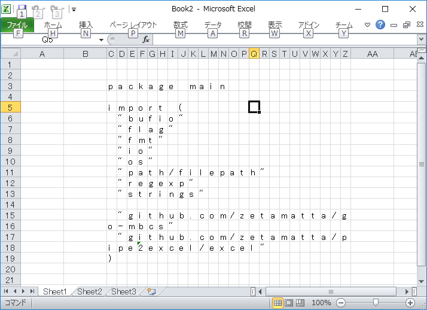

GodExcel !
==========

Insert textfile to excel sheet...

```
godexcel.exe C3 Z20 main.go
```



```
godexcel [-n] [-w WIDTH] [start-cell] [end-cell] [excel-name.xlsx] textfile(s)...
```

* `-n` do not change column-width
* `-w WIDTH` set column-width
* `start-cell` left-top position like A1
* `end-cell` right-bottom position like Z99
* `-z` convert hankaku to zenkaku
